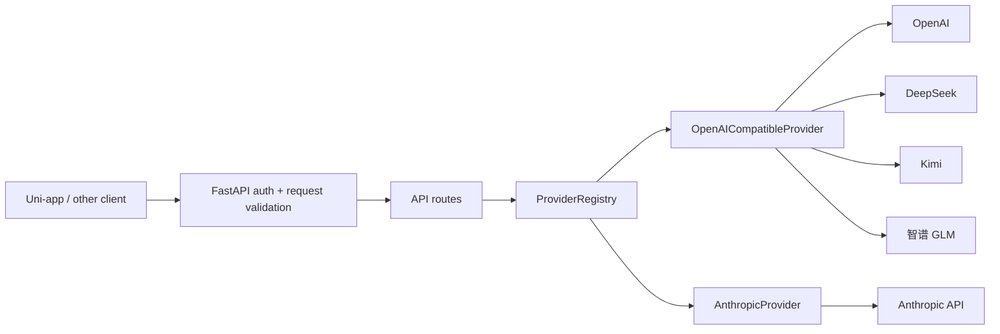
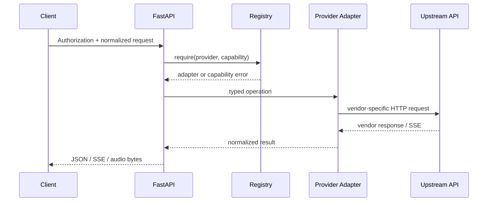
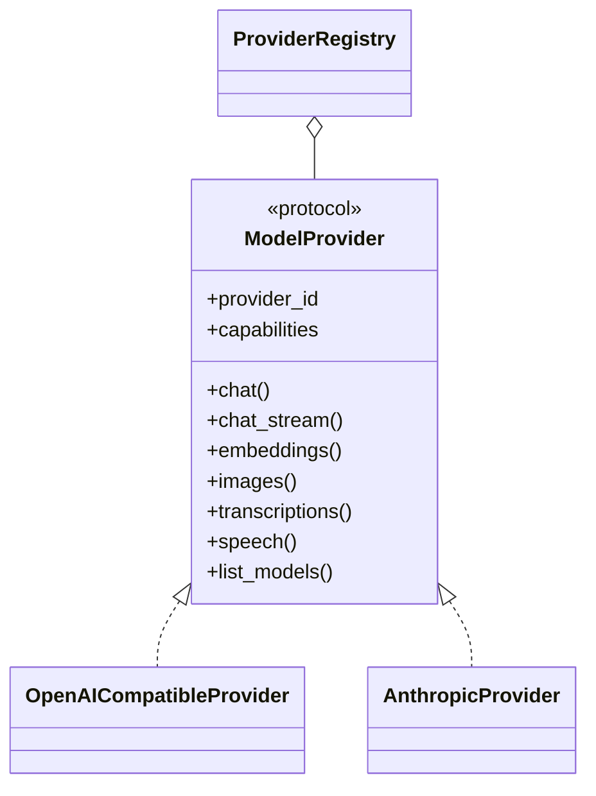

# Provider UML

规范位置已迁移到 [`docs/uml/provider-gateway.md`](uml/provider-gateway.md)，本文件保留兼容链接。

## 组件图

```mermaid
flowchart LR
  Client[Uni-app / other client] --> Auth[FastAPI auth + request validation]
  Auth --> Routes[API routes]
  Routes --> Registry[ProviderRegistry]
  Registry --> OpenAI[OpenAICompatibleProvider]
  Registry --> Anthropic[AnthropicProvider]
  OpenAI --> O1[OpenAI]
  OpenAI --> O2[DeepSeek]
  OpenAI --> O3[Kimi]
  OpenAI --> O4[智谱 GLM]
  Anthropic --> O5[Anthropic API]
```

## 调用时序

```mermaid
sequenceDiagram
  participant C as Client
  participant F as FastAPI
  participant R as Registry
  participant P as Provider Adapter
  participant U as Upstream API
  C->>F: Authorization + normalized request
  F->>R: require(provider, capability)
  R-->>F: adapter or capability error
  F->>P: typed operation
  P->>U: vendor-specific HTTP request
  U-->>P: vendor response / SSE
  P-->>F: normalized result
  F-->>C: JSON / SSE / audio bytes
```

## 扩展关系

```mermaid
classDiagram
  class ModelProvider {
    <<protocol>>
    +provider_id
    +capabilities
    +chat()
    +chat_stream()
    +embeddings()
    +images()
    +transcriptions()
    +speech()
    +list_models()
  }
  class OpenAICompatibleProvider
  class AnthropicProvider
  class ProviderRegistry
  ModelProvider <|.. OpenAICompatibleProvider
  ModelProvider <|.. AnthropicProvider
  ProviderRegistry o-- ModelProvider
```
