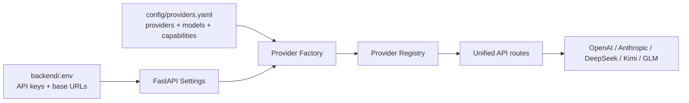
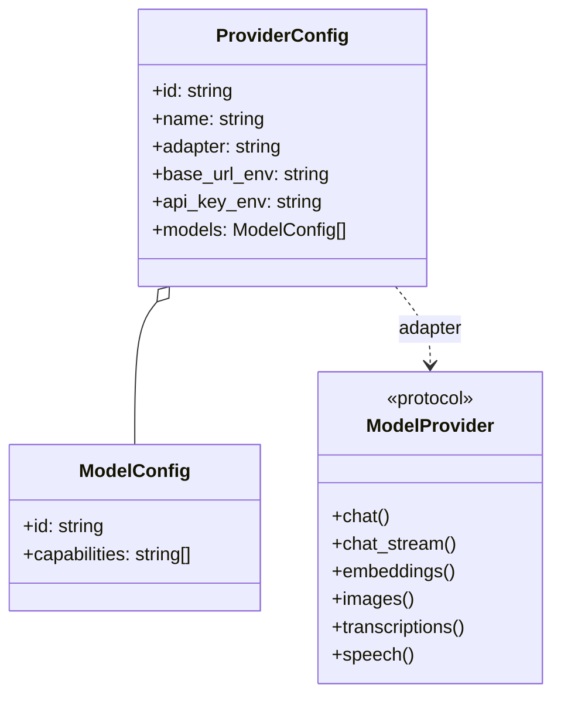

# Provider Gateway UML

## 配置与运行时关系

```mermaid
flowchart LR
  Env[backend/.env\nAPI keys + base URLs] --> Settings[FastAPI Settings]
  Catalog[config/providers.yaml\nproviders + models + capabilities] --> Factory[Provider Factory]
  Settings --> Factory
  Factory --> Registry[Provider Registry]
  Registry --> Routes[Unified API routes]
  Routes --> Upstream[OpenAI / Anthropic / DeepSeek / Kimi / GLM]
```

## Provider 与模型

```mermaid
classDiagram
  class ProviderConfig {
    +id: string
    +name: string
    +adapter: string
    +base_url_env: string
    +api_key_env: string
    +models: ModelConfig[]
  }
  class ModelConfig {
    +id: string
    +capabilities: string[]
  }
  class ModelProvider {
    <<protocol>>
    +chat()
    +chat_stream()
    +embeddings()
    +images()
    +transcriptions()
    +speech()
  }
  ProviderConfig o-- ModelConfig
  ProviderConfig ..> ModelProvider : adapter
```
